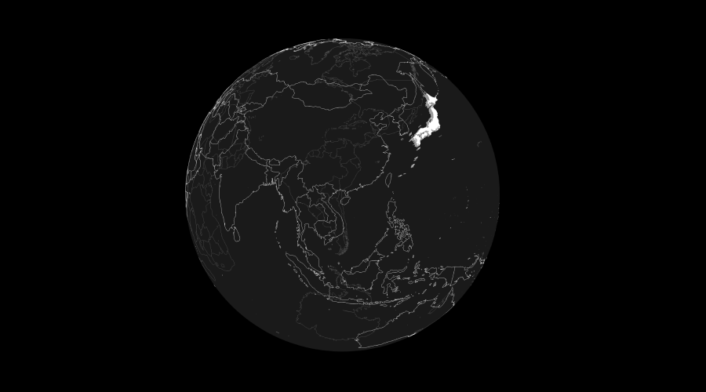

# three-geojson

[](https://github.com/gkjohnson/three-geojson/actions)
[](https://github.com/gkjohnson/three-geojson/)
[](https://twitter.com/garrettkjohnson)
[](https://github.com/sponsors/gkjohnson/)



Three.js shape loaders for [GeoJSON](https://geojson.org/) ([readable html](https://stevage.github.io/geojson-spec/)) and [WKT](https://en.wikipedia.org/wiki/Well-known_text_representation_of_geometry) formats. Supports generation of three.js line geometry in addition to flat and extruded tringulated meshes. All generated geometry are transformed and centered using 64-bit Javascript floating point operations with meshes are offset to retain precision in GPU operations.

Uses [@turfjs/unkink-polygon](https://www.npmjs.com/package/@turf/unkink-polygon), [@mapbox/delaunator](https://github.com/mapbox/delaunator), [@kninnug/constrainautor](https://github.com/kninnug/Constrainautor), and [@placemark/betterknown](https://github.com/placemark/betterknown) packages for polygon triangulation and WKT parsing. World GeoJSON file courtesy of [geojson-maps](https://geojson-maps.kyd.au/).

Some key features supported by this project:
- Support for detecting and fixing self-intersecting polygons so they tringulate correctly.
- Uses constrained delaunay triangulation for correct, high quality triangulation and support for inner vertices.
- Smooth surface normals are generated for ellipsoid-projected shapes.
- Outputs centered geometry with and matrix transform offset to avoid preceision-related artifacts on CPU and GPU when processing high-detail shapes.
- Supports altitude values.

> [!NOTE]
> This project is not hosted on npm and must be installed via Github repository.

# Examples

[WGS84 Lines](https://gkjohnson.github.io/three-geojson/example/bundle/globe.html)

[WGS84 Extruded Polygons](https://gkjohnson.github.io/three-geojson/example/bundle/globe.html?country=.)

[WGS84 Wireframe Polygons](https://gkjohnson.github.io/three-geojson/example/bundle/globe.html?country=.&wireframe=true)

[Extruded Polygon](https://gkjohnson.github.io/three-geojson/example/bundle/extruded.html)

[WKT Polygon](https://gkjohnson.github.io/three-geojson/example/bundle/wkt.html)

# Installation

```
npm install github:@gkjohnson/three-geojson
```

# Use

```js
// load the content
const result = await new GeoJSON().loadAsync( url );

// extract polygon lines and project them onto the globe
const transformer = new GeoJSONTransformer();
result.polygons.forEach( polygon => {

  const line = polygon.getLineObject();
  transformer.transformObject( line );
  scene.add( line );

} );
```

# API

## GeoJSONResult

```ts
{
  // list of features in the file
  features: Array<Feature>,

  // list of all geometries in the file
  geometries: Array<Polygon|LineString|Points>,

  // lists of specific geometry types
  polygons: Array<Polygon>,
  lines: Array<LineString>,
  points: Array<Points>,
}
```

**Feature**

Definition of a feature that includes properties originally defined in the GeoJSON file.

```ts
{
  type: 'Feature',
  id: string | null,
  properties: object,

  // list of all geometries in the feature
  geometries: Array<Polygon|LineString|Points>,

  // lists of specific geometry types
  polygons: Array<Polygon>,
  lines: Array<LineString>,
  points: Array<Points>,
}
```

**Points**

Definition of a parsed set of point geometry.

```ts
{
  type: string,
  feature: Feature,
  data: Vector3 | Array<Vector3>,
}
```

**LineString**

Definition of a parsed set of line string geometry. `Ellipsoid` is from the 3d-tiles-renderer project.

```ts
{
  type: string,
  feature: Feature,

  // function for building three.js LineSegments from the line data
  getLineObject( options?: object ): LineSegments,
}
```

**Polygon**

Definition of a parsed set of polygon geometry. `Ellipsoid` is from the 3d-tiles-renderer project.

```ts
{
  type: string,
  feature: Feature,

  // functions for building three.js LineSegments and Mesh from the line data
  getLineObject( options?: object ): LineSegments,
  getMeshObject( options?: object ): Mesh,
}
```

**Mesh Generation Options**

Descriptions of the options used in the `getLineObject` and `getMeshObject` functions above.

```js
{
  // The offset of the generated geometry on the z axis.
  offset = 0: number,

	// A value to scale the embedded geojson-embedded altitude values by. The offset
	// option value is not multiplied by this.
	altitudeScale = 1: number,

  // If "true" then any altitude or z-values are ignored.
  flat = false: boolean,

  // The ellipsoid to use to project the generated geometry onto a globe surface.
  // If no ellipsoid is provided then no projection is done.
  // Ellipsoid class should be shaped like that from the 3d-tiles-renderer project.
  ellipsoid = null: Ellipsoid,

  // The spacing to use when generating internal points and edge resampling for
  // triangulation. Useful when projecting a geometry to an ellipsoid surface
  // and more geometry detail is needed for the curvature.
  // If resolution is set to "null" then no resampling is done.
  resolution = null: number,
}
```

Additonal polygon "getMeshObject" options:

```js
{
  // The thickness of the generated geometry on the z axis
  thickness = 0: number,

  // Whether to use the "earcut" algorithm rather than delaunay for performance.
  // Note that this can result in some cases where triangles do not have sibling edges.
  useEarcut = false: boolean,

  // Whether to perform self polygon intersection checks and split polygons at intersections.
  // Can be disabled when a data set is known to be well-formed to improve performance.
  detectSelfIntersection = true: boolean,
}
```

## GeoJSONLoader

### fetchOptions

```js
fetchOptions = {}: object
```

Options passed to fetch.

### loadAsync

```js
loadAsync( url: string ): Promise<GeoJSONResult>
```

Loads and parses a geojson file.

### parse

```js
parse( content: string | object ): GeoJSONResult
```

Parses geojson content. Takes a raw or stringified json object.

### static getMeshObject

```js
static getMeshObject( objects: Array<Polygon>, options: Object ): Mesh
```

Returns a mesh that merges the result of all the provided Polygons. Each result is defined as a separate group in the resulting geometry in top cap, bottom cap, side geometry order.

### static getLineObject

```js
static getLineObject( objects: Array<Polygon|LineString>, options: Object ): LineSegments
```

Returns a line that merges the result of all the provided Polygons and LineStrings. Each result is defined as a separate group in the resulting geometry.

## WKTLoader

_extends GeoJSONLoader_

Loads and converts the WKT file to GeoJSON using [mapbox's wellknown](wellknown parser](https://github.com/mapbox/wellknown)) package, then parses it using the GeoJSONLoader parse function.
